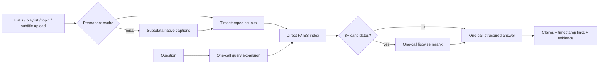

# VidWise

Multi-video YouTube research with claim-level, second-level citations. Add up to six videos, ask a cross-video question, and inspect the exact transcript evidence behind every answer claim.

> Deployment link and 15-second demo will be added only after the Docker HF Space passes a cold-browser test.

## What is implemented

- Supadata-first timestamped transcripts, permanent cache, and SRT/VTT/JSON/TXT upload fallback
- Direct FAISS search with plain-Python multi-query expansion and conditional Gemini listwise reranking
- A hard maximum of three `gemini-2.5-flash` calls per question
- Merged metadata-preserving indexes for 1–6 videos, public playlist import, and topic discovery
- Claim citations linking to `youtube.com/watch?v=…&t=Ns`, with expandable evidence
- Reproducible evaluation CLI that refuses unverified human labels
- Docker HF Space runtime, cold-start UX, daily budgets, 429 backoff, and metadata-only locked logs
- MCP tools for ingestion, corpus search, and topic research



## Run locally

Python 3.11 is the supported runtime.

```bash
python3 -m venv .venv
source .venv/bin/activate
pip install -r requirements.txt
cp .env.example .env
streamlit run app.py
```

Required secrets are `GOOGLE_API_KEY` and, for fresh live transcripts, `SUPADATA_API_KEY`. `YOUTUBE_API_KEY` enables playlist and topic discovery. The upload path works without Supadata. Never enable billing merely to run this near-zero-spend MVP.

## Verify and deploy

```bash
pytest -q
docker build -t vidwise .
docker run --rm -p 7860:7860 --env-file .env vidwise
```

Create a Docker-based Hugging Face Space and add secrets in Space settings. Free hardware sleeps; a cold start can take 2–3 minutes. The current design is intentionally single-worker, and ephemeral cache/log files may be lost after a Space restart.

## Evaluation set

The evaluation set begins with 15 questions, including three negatives, and expands to 25–40 after the core loop is validated. Ground truth must be personally checked against public-video timestamps. The runner fails closed while labels are pending:

```bash
python3 benchmarks/run_eval.py --model gemini-2.5-flash --config all --runs 3
inspect eval benchmarks/inspect_task
```

See [protocol](benchmarks/PROTOCOL.md), [results and failure analysis](benchmarks/RESULTS.md), and [methodology](docs/METHODOLOGY.md). No metric is presented until reproduced from a versioned run artifact.

## Limits and privacy

- 15 questions/session/day and 500 shared questions/day protect free-tier usage.
- Supadata documents 100 free credits/month; provider-wide remaining credits are not available from the transcript response. Upload remains available when quota is exhausted.
- Runtime logs contain latency, counts, and a hashed session identifier—not questions, answers, API keys, or raw transcripts.
- Private, deleted, restricted, and captionless-native videos can fail independently without discarding the rest of the corpus.
- No full scraped transcript is included in the evaluation set or public dataset.

## Repository

`core/` contains ingestion, FAISS retrieval, and grounded answers; `benchmarks/` contains evaluation code/data; `docs/CONTEXT.md` is the implementation handoff; `mcp_server.py` exposes the research tools.

MIT licensed.
